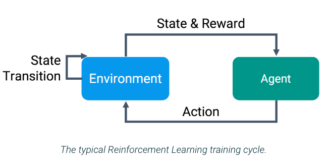
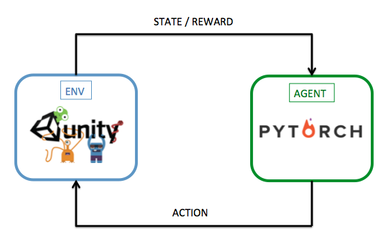
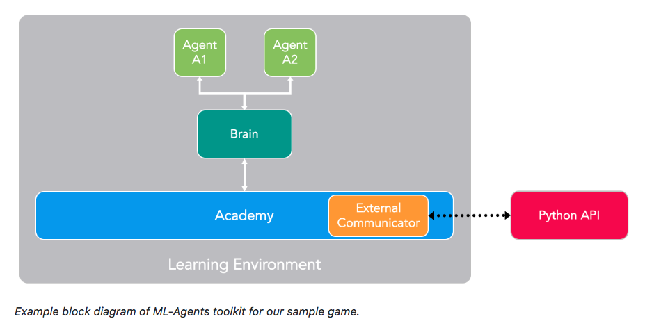
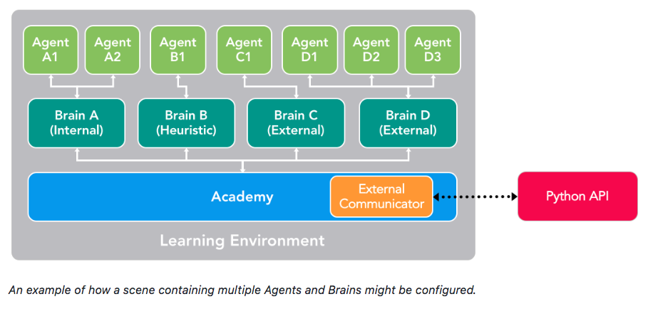

# Report: "Project 1 - Navigation"

We will train a DeepRL agent to solve a Unity Environment.

## Architecture

+ This image represents the flow of processes in a reinforcement learning training cycle.

+ In this project, we use Unity like environment simulator engine and we use the PyTorch framework to build the deep RL agent.

+ The next image defines the block diagram of ML-Agents toolkit for our sample environment. 
+ In our project, we use an unique agent.

## Code

The code is written in PyTorch and Python 3.6.2.

Main Files:  

+  Banana.app
   This app will simulate the Unity environment.
+ dgq_agent.py
   This code defines the agent.
+ model.py
   This code defines de model of Neural Network architecture.
+ DQN-Unity-ML.ipynb
   This notebook will train the agent.
+ checkpoint.pth
   Saved model weights of the successful agent.

## Learning Algorithm

We implement an artificial agent, termed Deep Q-Network (DQN), to build the Deep Q-Learning algorithm. DQN Methods are defined in the paper ["Human-level control through deep reinforcement learning"](https://deepmind.com/research/publications/human-level-control-through-deep-reinforcement-learning/) 

### Hyper Parameters

#### Deep Q-Learning Parameters

+ BUFFER_SIZE = int(1e5)  # replay buffer size
+ BATCH_SIZE = 64         # minibatch size
+ GAMMA = 0.99            # discount factor
+ TAU = 1e-3              # for soft update of target parameters
+ LR = 5e-4               # learning rate 
+ UPDATE_EVERY = 4        # how often to update the network

#### Neural Network. Model Architecture & Parameters.

We build a Deep Q-Network (DQN) to build the Deep Q-Learning algorithm. The Deep Q-Learning algorithm uses two separate networks with identical model architectures.

For this project we use a model with fully-connected linear layers and ReLu activations.
The input layer is a fully-connected linear layer with 37 inputs(features). These inputs are the 37 signals that define the status of our environment.  
The output layer is a fully-connected linear layer with a single output for each valid action. Like the env possible actions are 4, we have 4 outputs(features) in the last layer.

Model:
+ (fc1): Linear(in_features=37, out_features=64, bias=True)
+ (fc2): Linear(in_features=64, out_features=64, bias=True)
+ (fc3): Linear(in_features=64, out_features=4, bias=True)

### Training

Video of Training:

[youtube video](https://youtu.be/jmVKljg22sM)

<!---

--->

### Plot of Rewards

Environment solved in 547 episodes. Average Score: 15.01

A plot of rewards per episode is included to illustrate that the agent is able to receive an average reward (over 100 episodes) of at least +15.

### Watch The DQN-Agent in Action

Video of The DQN-Agent:

[youtube video](https://youtu.be/_znGmJF6tKQ)
<!--- 

--->

### Ideas for Future Work

Future ideas for improving the agent's performance.

1. Implement the new improvements(extensions) to the original Deep Q-Learning algorithm. Each of the six extensions address a different issue with the original DQN algorithm.
    1. Double DQN
    2. Prioritized Experience Replay
    3. Dueling DQN
    4. Learning from multi-step bootstrap targets (A3C)
    5. Distributional DQN
    6. Noisy DQN

2. Implement all the extensions in the same algorithm Rainbow. Researchers at Google DeepMind recently tested the performance of an agent that incorporated all six of these modifications. The corresponding algorithm was termed Rainbow.

<!---

-->

3. The lower image is an example of an architecture with multiple Agents and Brains. This architecture could improve the agent's performance.

 **TO-DO**
4. Learn from pixels
5. New Algoritms: PPO, etc
6. Read Unity-docs for new ideas

### Suggestions to Make Your Project Stand Out!

+ [x] Include a GIF and/or link to a YouTube video of your trained agent!
+ [x] Solve the environment in fewer than 1800 episodes!
+ [ ] Write a blog post explaining the project and your implementation!
+ [ ] Implement a double DQN, a dueling DQN, and/or prioritized experience replay!
+ [ ] For an extra challenge after passing this project, try to train an agent from raw pixels! Check out (Optional) Challenge: Learning from Pixels in the classroom for more details.

#### References

1. [Udacity Gihub Repo](https://github.com/udacity/deep-reinforcement-learning)
2. [Unity Docs](https://github.com/Unity-Technologies/ml-agents/blob/master/docs/ML-Agents-Overview.md)
3. [Unity Paper](https://arxiv.org/abs/1809.02627)
