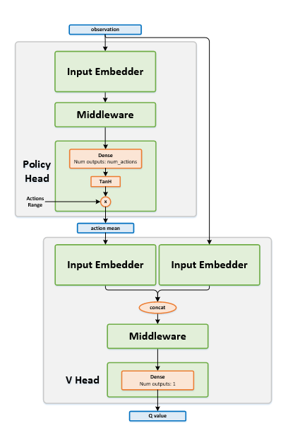

[image1]: https://user-images.githubusercontent.com/10624937/43851024-320ba930-9aff-11e8-8493-ee547c6af349.gif "Trained Agent"
[image2]: https://user-images.githubusercontent.com/10624937/43851646-d899bf20-9b00-11e8-858c-29b5c2c94ccc.png "Crawler"

# Report: "Project " - Continous Control"

We will train a DeepRL agent to solve a Unity Environment.

## Architecture

+ This image represents the flow of processes in a reinforcement learning training cycle.

+ In this project, we use Unity like environment simulator engine and we use the PyTorch framework to build the deep RL agent.

+ The next image defines the block diagram of ML-Agents toolkit for our sample environment. 
+ In our project, we use an unique agent.

## Unity Environment

+ Set-up: Double-jointed arm which can move to target locations.
+ Goal: The agents must move it's hand to the goal location, and keep it there.
+ Agents: The environment contains 20 agents linked to a single Brain.
+ Agent Reward Function (independent):
  + 0.1 Each step agent's hand is in goal location.
+ Brains: One Brain with the following observation/action space.
  + Vector Observation space: 33 variables corresponding to position, rotation, velocity, and angular velocities of the two arm Rigidbodies.
  + Vector Action space: 
      + Size of 4, corresponding to torque applicable to two joints.
      + Continuous: Every entry in the action vector should be a number between -1 and 1.
  + Visual Observations: None.
+ Reset Parameters: Two, corresponding to goal size, and goal movement speed.
+ Benchmark Mean Reward: 30

![Trained Agent][image1]

In this environment, a double-jointed arm can move to target locations. A reward of +0.1 is provided for each step that the agent's hand is in the goal location. Thus, the goal of your agent is to maintain its position at the target location for as many time steps as possible.

~~~~
Unity Academy name: Academy
        Number of Brains: 1
        Number of External Brains : 1
        Lesson number : 0
        Reset Parameters :
         goal_speed -> 1.0
         goal_size -> 5.0
Unity brain name: ReacherBrain
        Number of Visual Observations (per agent): 0
        Vector Observation space type: continuous
        Vector Observation space size (per agent): 33
        Number of stacked Vector Observation: 1
        Vector Action space type: continuous
        Vector Action space size (per agent): 4
        Vector Action descriptions: , , ,
~~~~

~~~~
Number of agents: 20
Size of each action: 4
There are 20 agents. Each observes a state with length: 33
The state for the first agent looks like: 
[ 0.00000000e+00 -4.00000000e+00  0.00000000e+00  1.00000000e+00
 -0.00000000e+00 -0.00000000e+00 -4.37113883e-08  0.00000000e+00
  0.00000000e+00  0.00000000e+00  0.00000000e+00  0.00000000e+00
  0.00000000e+00  0.00000000e+00 -1.00000000e+01  0.00000000e+00
  1.00000000e+00 -0.00000000e+00 -0.00000000e+00 -4.37113883e-08
  0.00000000e+00  0.00000000e+00  0.00000000e+00  0.00000000e+00
  0.00000000e+00  0.00000000e+00  5.75471878e+00 -1.00000000e+00
  5.55726624e+00  0.00000000e+00  1.00000000e+00  0.00000000e+00
 -1.68164849e-01]
~~~~

## Code

The code is written in PyTorch 0.4 and Python 3.6.2.

Main Files:  

+ ./apps/Reacher.app : Contains the unity app. This app will simulate the Unity environment.
+ ddpq_agent.py: This code defines the ddpg agent.
+ model.py: This code defines de model of Neural Network architecture.
+ Continuous_Control_Rober.ipynb: This notebook will train the agent.
+ ./cp folder: Contains the checkpoints of models of the successful agent.

## Learning Algorithm

We implement an artificial agent, termed [Deep Deterministic Policy Gradient](https://spinningup.openai.com/en/latest/algorithms/ddpg.html)(DDPG)

DDPG is an algorithm which concurrently learns a Q-function and a policy. It uses off-policy data and the Bellman equation to learn the Q-function, and uses the Q-function to learn the policy.

+ DDPG is an off-policy algorithm.
+ DDPG can only be used for environments with continuous action spaces.
+ DDPG can be thought of as being deep Q-learning for continuous action spaces.
+ DDPG can be implemented with parallelization

DDPG is a similarly foundational algorithm to VPG. DDPG is closely connected to Q-learning algorithms, and it concurrently learns a Q-function and a policy which are updated to improve each other.

Algorithms like DDPG and Q-Learning are off-policy, so they are able to reuse old data very efficiently. They gain this benefit by exploiting Bellman’s equations for optimality, which a Q-function can be trained to satisfy using any environment interaction data (as long as there’s enough experience from the high-reward areas in the environment).

### Flow Chart

https://nervanasystems.github.io/coach/algorithms/policy_optimization/ddpg/

### Pseudocode

### Hyper Parameters
#### DDPG Parameters

+ UFFER_SIZE = int(1e6)   # replay buffer size
+ BATCH_SIZE = 1024       # minibatch size
+ GAMMA = 0.99            # discount factor
+ TAU = 1e-3              # for soft update of target parameters
+ LR_ACTOR = 1e-3         # learning rate of the actor 
+ LR_CRITIC = 1e-3        # learning rate of the critic before: 3e-4
+ WEIGHT_DECAY = 0.0000   # L2 weight decay
+ EPSILON = 1.0            # noise factor
+ EPSILON_DECAY = 1e-6     # decay of noise factor

#### Neural Network. Model Architecture & Parameters.
For this project we use these models:

Actor Model:
  (bn0): BatchNorm1d(33, eps=1e-05, momentum=0.1, affine=True, track_running_stats=True)
  (fc1): Linear(in_features=33, out_features=128, bias=True)
  (bn1): BatchNorm1d(128, eps=1e-05, momentum=0.1, affine=True, track_running_stats=True)
  (fc2): Linear(in_features=128, out_features=128, bias=True)
  (bn2): BatchNorm1d(128, eps=1e-05, momentum=0.1, affine=True, track_running_stats=True)
  (fc3): Linear(in_features=128, out_features=4, bias=True)

Critic Model:
  (bn0): BatchNorm1d(33, eps=1e-05, momentum=0.1, affine=True, track_running_stats=True)
  (fcs1): Linear(in_features=33, out_features=128, bias=True)
  (fc2): Linear(in_features=132, out_features=128, bias=True)
  (fc3): Linear(in_features=128, out_features=1, bias=True)

### Training

### Plot of Rewards

Environment solved in 170 episodes!	Average Score: 30.06

A plot of rewards per episode is included to illustrate that:

+ [ ] the agent receives an average reward (over 100 episodes) of at least +30
+ [x] the agent is able to receive an average reward (over 100 episodes, and over all 20 agents) of at least +30.

### Watch The DDPG Agent in Action

Video of trained DDPG Agent:

[youtube video](https://youtu.be/h6WyDX4cvek)
<!--- 

--->

### Ideas for Future Work

Future ideas for improving the agent's performance.

+ Try new algorithms like PPO, A3C, and D4PG that use multiple (non-interacting, parallel) copies of the same agent to distribute the task of gathering experience
+ *TODO*
+ Read book > chapter10 ?
+ Intel >> new alg ?
+ udacity lecture ?
+ Try [Hierarchical Actor Critic (HAC)](https://arxiv.org/abs/1712.00948.pdf) ([code](rl_coach/agents/ddpg_hac_agent.py))
+ Try [Hindsight Experience Replay (HER)](https://arxiv.org/abs/1707.01495.pdf) ([code](rl_coach/memories/episodic/episodic_hindsight_experience_replay.py))

#### References

1. [Udacity Gihub Repo](https://github.com/udacity/deep-reinforcement-learning)
2. [Unity Docs](https://github.com/Unity-Technologies/ml-agents/blob/master/docs/ML-Agents-Overview.md)
3. [Unity Paper](https://arxiv.org/abs/1809.02627)
4. [OpenAI master RL](https://spinningup.openai.com/en/latest/algorithms/ddpg.html)
5. [DDPG paper](https://arxiv.org/abs/1509.02971)
6. [OpenAI Baselines](https://blog.openai.com/better-exploration-with-parameter-noise/)
7. [Book: Deep Reinforcement Learning Hands-On](https://github.com/PacktPublishing/Deep-Reinforcement-Learning-Hands-On)
8. [PyTorch Agent Net: reinforcement learning toolkit for pytorch](https://github.com/Shmuma/ptan)
9. [Reinforcement Learning Coach by Intel® AI Lab](https://nervanasystems.github.io/coach/)
10. [RL Coach - DDPG - Docs](https://nervanasystems.github.io/coach/algorithms/policy_optimization/ddpg/)
11. [RL Coach - DDPG - Code](https://github.com/NervanaSystems/coach/blob/master/rl_coach/agents/ddpg_agent.py)
12. [Modularized Implementation of Deep RL Algorithms in PyTorch](https://github.com/ShangtongZhang/DeepRL)
   